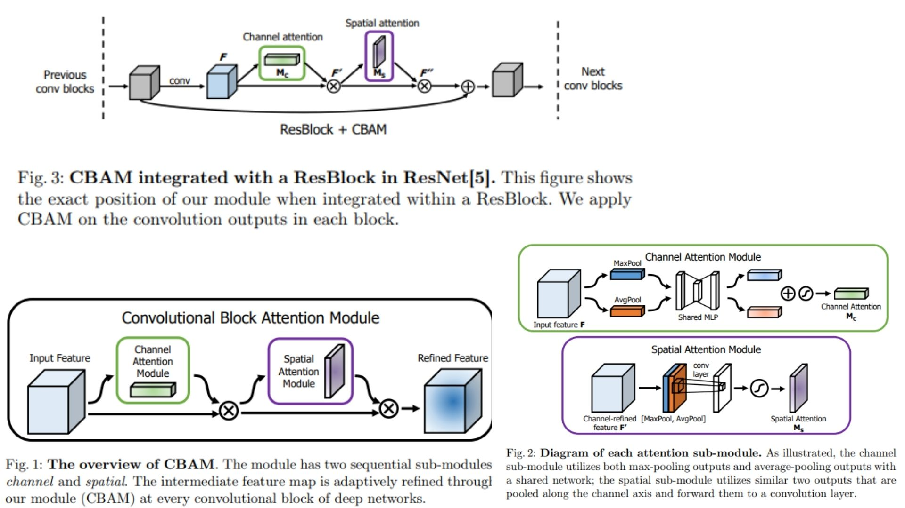

# 🌿 CBAM-Replication – Convolutional Block Attention Module

This repository provides a **PyTorch-based replication** of  
**CBAM: Convolutional Block Attention Module**.

The focus is **understanding and implementing CBAM attention mechanisms** in a practical pipeline,  
rather than achieving state-of-the-art benchmark performance.

- Sequentially refines feature maps with channel & spatial attention 🍃  
- Highlights **what** and **where** to focus in CNN features 🔹  
- Lightweight & **plug-and-play** design for any CNN architecture 🛠️  

**Paper reference:** [CBAM – Woo et al., 2018: Convolutional Block Attention Module](https://arxiv.org/abs/1807.06521) 📄

---

## 🌌 Overview – CBAM Pipeline



The core idea:

> Refine intermediate feature maps by sequentially applying channel attention (Mc) and spatial attention (Ms) → emphasize informative features and suppress irrelevant ones.

High-level procedure:

1. Extract features from a CNN backbone at an intermediate layer.  
2. Compute **channel attention** to identify *what* features are important.  
3. Apply **spatial attention** to identify *where* important features are located.  
4. Multiply attention maps with input features to obtain **refined feature maps**.  
5. Forward refined features through the remaining network.  

This module can be plugged **per block** and is **end-to-end trainable**.

---

## 🧮 Attention Computation

### Channel Attention
Given an input feature map $F \in \mathbb{R}^{C \times H \times W}$, CBAM computes the channel attention map $M_c \in \mathbb{R}^{C \times 1 \times 1}$:

$$
M_c(F) = \sigma(\text{MLP}(\text{AvgPool}(F)) + \text{MLP}(\text{MaxPool}(F)))
$$

Where $\sigma$ is the sigmoid function, and MLP is a shared network with one hidden layer of size $C/r$.  

### Spatial Attention
The spatial attention map $M_s \in \mathbb{R}^{1 \times H \times W}$ is computed as:

$$
M_s(F) = \sigma(f_{7\times7}([\text{AvgPool}(F); \text{MaxPool}(F)]))
$$

Where $f_{7\times7}$ is a convolution with kernel size $7\times7$, and channel-wise pooling outputs are concatenated.  

### Feature Refinement
The final refined feature map is:

$$
F' = M_c(F) \otimes F, \quad F'' = M_s(F') \otimes F'
$$

Where $\otimes$ denotes element-wise multiplication with broadcasting along the spatial or channel dimensions.

---

## 🧠 What the Module Does

- Focuses on **meaningful channels** and **informative spatial regions**  
- Suppresses irrelevant or redundant features  
- Enhances feature representation without adding significant parameters  
- Can be integrated into **any CNN block**, e.g., ResNet, VGG  

---

## 📦 Repository Structure

```bash
CBAM-Replication/
├── src/
│   ├── layers/
│   │   ├── conv_layer.py          # Standard Conv2d wrapper
│   │   ├── activation.py          # ReLU, sigmoid helpers
│   │   └── normalization.py       # BatchNorm or LayerNorm support
│   │
│   ├── attention/
│   │   ├── channel_attention.py   # Mc computation (avg+max pooling + MLP)
│   │   └── spatial_attention.py   # Ms computation (avg+max pooling + conv)
│   │
│   ├── backbone/
│   │   └── resnet_blocks.py       # CNN block + CBAM integration
│   │
│   ├── model/
│   │   └── cbam_cnn.py            # CNN + CBAM forward logic
│   │
│   ├── utils/
│   │   └── visualization.py       # Feature map or attention map visualization
│   │
│   └── config.py                  # Hyperparameters: reduction ratio, conv channels, input size
│
├── images/
│   └── figmix.jpg                  # CBAM overview & feature refinement example
│
├── requirements.txt
└── README.md
```
---


## 🔗 Feedback

For questions or feedback, contact: [barkin.adiguzel@gmail.com](mailto:barkin.adiguzel@gmail.com)
